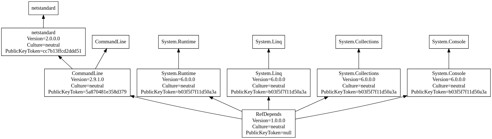

# 'Where Used' - who is using what in .NET Core


Just recently, we published our service project and tried to run it:

```bash
# build + publish
$ dotnet publish -c Release -o out

# run project from publishing directory
$ cd out
$ ./Best.Ever.Service.exe
```

and we got this error:

```text
Unhandled exception. System.IO.FileNotFoundException: Could not load file or assembly 'Microsoft.Extensions.DependencyModel, Version=3.0.0.0, Culture=neutral, PublicKeyToken=adb9793829ddae60'. The system cannot find the file specified.
File name: 'Microsoft.Extensions.DependencyModel, Version=3.0.0.0, Culture=neutral, PublicKeyToken=adb9793829ddae60'
   at Program.<>c.<<Main>$>b__0_0(HostBuilderContext context, LoggerConfiguration service)
   at Serilog.SerilogHostBuilderExtensions.<>c__DisplayClass2_0.<UseSerilog>b__0(HostBuilderContext hostBuilderContext, IServiceProvider services, LoggerConfiguration loggerConfiguration)
   at Serilog.SerilogHostBuilderExtensions.<>c__DisplayClass3_1.<UseSerilog>b__1(IServiceProvider services)
   at Microsoft.Extensions.DependencyInjection.ServiceLookup.CallSiteVisitor`2.VisitCallSiteMain(ServiceCallSite callSite, TArgument argument)
   at Microsoft.Extensions.DependencyInjection.ServiceLookup.CallSiteRuntimeResolver.VisitRootCache(ServiceCallSite callSite, RuntimeResolverContext context)
   at Microsoft.Extensions.DependencyInjection.ServiceLookup.CallSiteVisitor`2.VisitCallSite(ServiceCallSite callSite, TArgument argument)
   at Microsoft.Extensions.DependencyInjection.ServiceLookup.CallSiteRuntimeResolver.Resolve(ServiceCallSite callSite, ServiceProviderEngineScope scope)
   at Microsoft.Extensions.DependencyInjection.ServiceProvider.CreateServiceAccessor(Type serviceType)
```

OK - it's obvious that _Serilog_ cannot find the correct version of _Microsoft.Extensions.DependencyModel_
as the one in the output directory is _2.1.0.0_  The mystery now is:  which component brought in this older version...

This project is a simple _where-used_ utility which scans a directory for .NET assemblies and prints out
which other assemblies use each assembly.

<details>
  <summary>What was the problem?</summary>

After running this utility on the `out` directory, here are the relevant lines:

```text
Microsoft.Extensions.DependencyModel, Version=2.1.0.0, Culture=neutral, PublicKeyToken=adb9793829ddae60
  coverlet.core, Version=3.1.0.0, Culture=neutral, PublicKeyToken=31d7fc2a7e877089
Microsoft.Extensions.DependencyModel, Version=3.0.0.0, Culture=neutral, PublicKeyToken=adb9793829ddae60
  Best.Ever.Service, Version=1.0.0.0, Culture=neutral, PublicKeyToken=null
  Serilog.Settings.Configuration, Version=3.3.0.0, Culture=neutral, PublicKeyToken=24c2f752a8e58a10
```

It looks like our unit test code coverage (_coverlet.core_) is bringing in an older version of _Microsoft.Extensions.DependencyModel_

The solution is not to publish the *whole* solution, but only the .NET project which contains our service.

</details>

## Prerequisites
* .NET Core 6

## Getting started
```bash
$ git clone https://github.com/TrevorDArcyEvans/RefDepends.git
$ cd RefDepends
$ dotnet restore
$ dotnet build
$ cd /bin/Debug/net6.0
$ ./RefDepends.exe -d output.dot
netstandard
  netstandard, Version=2.0.0.0, Culture=neutral, PublicKeyToken=cc7b13ffcd2ddd51
    CommandLine, Version=2.9.1.0, Culture=neutral, PublicKeyToken=5a870481e358d379
System.Runtime
  System.Runtime, Version=6.0.0.0, Culture=neutral, PublicKeyToken=b03f5f7f11d50a3a
    RefDepends, Version=1.0.0.0, Culture=neutral, PublicKeyToken=null
CommandLine
  CommandLine, Version=2.9.1.0, Culture=neutral, PublicKeyToken=5a870481e358d379
    RefDepends, Version=1.0.0.0, Culture=neutral, PublicKeyToken=null
System.Linq
  System.Linq, Version=6.0.0.0, Culture=neutral, PublicKeyToken=b03f5f7f11d50a3a
    RefDepends, Version=1.0.0.0, Culture=neutral, PublicKeyToken=null
System.Collections
  System.Collections, Version=6.0.0.0, Culture=neutral, PublicKeyToken=b03f5f7f11d50a3a
    RefDepends, Version=1.0.0.0, Culture=neutral, PublicKeyToken=null
System.Console
  System.Console, Version=6.0.0.0, Culture=neutral, PublicKeyToken=b03f5f7f11d50a3a
    RefDepends, Version=1.0.0.0, Culture=neutral, PublicKeyToken=null
```

## Usage
```bash
$ ./RefDepends --help
RefDepends 1.0.0
Copyright (C) 2023 RefDepends

  -d, --dot       Path to output output dot file

  --help          Display this help screen.

  --version       Display version information.

  value pos. 0    Path to directory to analyse
```

### Sample output
```text
netstandard
  netstandard, Version=2.0.0.0, Culture=neutral, PublicKeyToken=cc7b13ffcd2ddd51
    CommandLine, Version=2.9.1.0, Culture=neutral, PublicKeyToken=5a870481e358d379
System.Runtime
  System.Runtime, Version=6.0.0.0, Culture=neutral, PublicKeyToken=b03f5f7f11d50a3a
    RefDepends, Version=1.0.0.0, Culture=neutral, PublicKeyToken=null
CommandLine
  CommandLine, Version=2.9.1.0, Culture=neutral, PublicKeyToken=5a870481e358d379
    RefDepends, Version=1.0.0.0, Culture=neutral, PublicKeyToken=null
System.Linq
  System.Linq, Version=6.0.0.0, Culture=neutral, PublicKeyToken=b03f5f7f11d50a3a
    RefDepends, Version=1.0.0.0, Culture=neutral, PublicKeyToken=null
System.Collections
  System.Collections, Version=6.0.0.0, Culture=neutral, PublicKeyToken=b03f5f7f11d50a3a
    RefDepends, Version=1.0.0.0, Culture=neutral, PublicKeyToken=null
System.Console
  System.Console, Version=6.0.0.0, Culture=neutral, PublicKeyToken=b03f5f7f11d50a3a
    RefDepends, Version=1.0.0.0, Culture=neutral, PublicKeyToken=null
```

### Dotgraph support


<details>
  <summary>output.dot</summary>

```text
digraph G
{
 rankdir="BT";
 {
    node [shape=box]
    "netstandard";
    "netstandard
 Version=2.0.0.0
 Culture=neutral
 PublicKeyToken=cc7b13ffcd2ddd51";
    "CommandLine
 Version=2.9.1.0
 Culture=neutral
 PublicKeyToken=5a870481e358d379";
    "System.Runtime";
    "System.Runtime
 Version=6.0.0.0
 Culture=neutral
 PublicKeyToken=b03f5f7f11d50a3a";
    "RefDepends
 Version=1.0.0.0
 Culture=neutral
 PublicKeyToken=null";
    "CommandLine";
    "System.Linq";
    "System.Linq
 Version=6.0.0.0
 Culture=neutral
 PublicKeyToken=b03f5f7f11d50a3a";
    "System.Collections";
    "System.Collections
 Version=6.0.0.0
 Culture=neutral
 PublicKeyToken=b03f5f7f11d50a3a";
    "System.Console";
    "System.Console
 Version=6.0.0.0
 Culture=neutral
 PublicKeyToken=b03f5f7f11d50a3a";
 }

"netstandard
Version=2.0.0.0
Culture=neutral
PublicKeyToken=cc7b13ffcd2ddd51" -> "netstandard";
"CommandLine
Version=2.9.1.0
Culture=neutral
PublicKeyToken=5a870481e358d379" -> "netstandard
Version=2.0.0.0
Culture=neutral
PublicKeyToken=cc7b13ffcd2ddd51";
"System.Runtime
Version=6.0.0.0
Culture=neutral
PublicKeyToken=b03f5f7f11d50a3a" -> "System.Runtime";
"RefDepends
Version=1.0.0.0
Culture=neutral
PublicKeyToken=null" -> "System.Runtime
Version=6.0.0.0
Culture=neutral
PublicKeyToken=b03f5f7f11d50a3a";
"CommandLine
Version=2.9.1.0
Culture=neutral
PublicKeyToken=5a870481e358d379" -> "CommandLine";
"RefDepends
Version=1.0.0.0
Culture=neutral
PublicKeyToken=null" -> "CommandLine
Version=2.9.1.0
Culture=neutral
PublicKeyToken=5a870481e358d379";
"System.Linq
Version=6.0.0.0
Culture=neutral
PublicKeyToken=b03f5f7f11d50a3a" -> "System.Linq";
"RefDepends
Version=1.0.0.0
Culture=neutral
PublicKeyToken=null" -> "System.Linq
Version=6.0.0.0
Culture=neutral
PublicKeyToken=b03f5f7f11d50a3a";
"System.Collections
Version=6.0.0.0
Culture=neutral
PublicKeyToken=b03f5f7f11d50a3a" -> "System.Collections";
"RefDepends
Version=1.0.0.0
Culture=neutral
PublicKeyToken=null" -> "System.Collections
Version=6.0.0.0
Culture=neutral
PublicKeyToken=b03f5f7f11d50a3a";
"System.Console
Version=6.0.0.0
Culture=neutral
PublicKeyToken=b03f5f7f11d50a3a" -> "System.Console";
"RefDepends
Version=1.0.0.0
Culture=neutral
PublicKeyToken=null" -> "System.Console
Version=6.0.0.0
Culture=neutral
PublicKeyToken=b03f5f7f11d50a3a";
}
```
</details>

[GraphvizOnline](https://dreampuf.github.io/GraphvizOnline/#digraph%20G%0A%7B%0A%20rankdir%3D%22BT%22%3B%0A%20%7B%0A%20%20%20%20node%20%5Bshape%3Dbox%5D%0A%20%20%20%20%22netstandard%22%3B%0A%20%20%20%20%22netstandard%0A%20Version%3D2.0.0.0%0A%20Culture%3Dneutral%0A%20PublicKeyToken%3Dcc7b13ffcd2ddd51%22%3B%0A%20%20%20%20%22CommandLine%0A%20Version%3D2.9.1.0%0A%20Culture%3Dneutral%0A%20PublicKeyToken%3D5a870481e358d379%22%3B%0A%20%20%20%20%22System.Runtime%22%3B%0A%20%20%20%20%22System.Runtime%0A%20Version%3D6.0.0.0%0A%20Culture%3Dneutral%0A%20PublicKeyToken%3Db03f5f7f11d50a3a%22%3B%0A%20%20%20%20%22RefDepends%0A%20Version%3D1.0.0.0%0A%20Culture%3Dneutral%0A%20PublicKeyToken%3Dnull%22%3B%0A%20%20%20%20%22CommandLine%22%3B%0A%20%20%20%20%22System.Linq%22%3B%0A%20%20%20%20%22System.Linq%0A%20Version%3D6.0.0.0%0A%20Culture%3Dneutral%0A%20PublicKeyToken%3Db03f5f7f11d50a3a%22%3B%0A%20%20%20%20%22System.Collections%22%3B%0A%20%20%20%20%22System.Collections%0A%20Version%3D6.0.0.0%0A%20Culture%3Dneutral%0A%20PublicKeyToken%3Db03f5f7f11d50a3a%22%3B%0A%20%20%20%20%22System.Console%22%3B%0A%20%20%20%20%22System.Console%0A%20Version%3D6.0.0.0%0A%20Culture%3Dneutral%0A%20PublicKeyToken%3Db03f5f7f11d50a3a%22%3B%0A%20%7D%0A%0A%20%20%22netstandard%0A%20Version%3D2.0.0.0%0A%20Culture%3Dneutral%0A%20PublicKeyToken%3Dcc7b13ffcd2ddd51%22%20-%3E%20%22netstandard%22%3B%0A%20%20%20%20%22CommandLine%0A%20Version%3D2.9.1.0%0A%20Culture%3Dneutral%0A%20PublicKeyToken%3D5a870481e358d379%22%20-%3E%20%22netstandard%0A%20Version%3D2.0.0.0%0A%20Culture%3Dneutral%0A%20PublicKeyToken%3Dcc7b13ffcd2ddd51%22%3B%0A%20%20%22System.Runtime%0A%20Version%3D6.0.0.0%0A%20Culture%3Dneutral%0A%20PublicKeyToken%3Db03f5f7f11d50a3a%22%20-%3E%20%22System.Runtime%22%3B%0A%20%20%20%20%22RefDepends%0A%20Version%3D1.0.0.0%0A%20Culture%3Dneutral%0A%20PublicKeyToken%3Dnull%22%20-%3E%20%22System.Runtime%0A%20Version%3D6.0.0.0%0A%20Culture%3Dneutral%0A%20PublicKeyToken%3Db03f5f7f11d50a3a%22%3B%0A%20%20%22CommandLine%0A%20Version%3D2.9.1.0%0A%20Culture%3Dneutral%0A%20PublicKeyToken%3D5a870481e358d379%22%20-%3E%20%22CommandLine%22%3B%0A%20%20%20%20%22RefDepends%0A%20Version%3D1.0.0.0%0A%20Culture%3Dneutral%0A%20PublicKeyToken%3Dnull%22%20-%3E%20%22CommandLine%0A%20Version%3D2.9.1.0%0A%20Culture%3Dneutral%0A%20PublicKeyToken%3D5a870481e358d379%22%3B%0A%20%20%22System.Linq%0A%20Version%3D6.0.0.0%0A%20Culture%3Dneutral%0A%20PublicKeyToken%3Db03f5f7f11d50a3a%22%20-%3E%20%22System.Linq%22%3B%0A%20%20%20%20%22RefDepends%0A%20Version%3D1.0.0.0%0A%20Culture%3Dneutral%0A%20PublicKeyToken%3Dnull%22%20-%3E%20%22System.Linq%0A%20Version%3D6.0.0.0%0A%20Culture%3Dneutral%0A%20PublicKeyToken%3Db03f5f7f11d50a3a%22%3B%0A%20%20%22System.Collections%0A%20Version%3D6.0.0.0%0A%20Culture%3Dneutral%0A%20PublicKeyToken%3Db03f5f7f11d50a3a%22%20-%3E%20%22System.Collections%22%3B%0A%20%20%20%20%22RefDepends%0A%20Version%3D1.0.0.0%0A%20Culture%3Dneutral%0A%20PublicKeyToken%3Dnull%22%20-%3E%20%22System.Collections%0A%20Version%3D6.0.0.0%0A%20Culture%3Dneutral%0A%20PublicKeyToken%3Db03f5f7f11d50a3a%22%3B%0A%20%20%22System.Console%0A%20Version%3D6.0.0.0%0A%20Culture%3Dneutral%0A%20PublicKeyToken%3Db03f5f7f11d50a3a%22%20-%3E%20%22System.Console%22%3B%0A%20%20%20%20%22RefDepends%0A%20Version%3D1.0.0.0%0A%20Culture%3Dneutral%0A%20PublicKeyToken%3Dnull%22%20-%3E%20%22System.Console%0A%20Version%3D6.0.0.0%0A%20Culture%3Dneutral%0A%20PublicKeyToken%3Db03f5f7f11d50a3a%22%3B%0A%7D%0A)

## Further work
* ~~generate a dot file so we can graphically view the where used information~~

## Acknowledgements
* tangled image from [Pretzel_knot](https://en.wikipedia.org/wiki/Tangle_%28mathematics%29)
